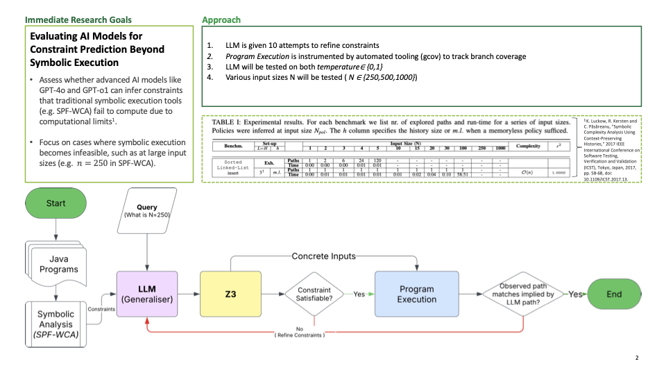

<h1 align="center">InvaR1ant Evaluation</h1>

<em>A framework for leveraging Large Language Models (LLMs) to generate constraints characterizing worst-case execution paths in programs.</em>

  

<h2 align="center">Table of Contents</h2>

<ul>
  <li><a href="#project-overview">Project Overview</a></li>
  <li><a href="#getting-started">Getting Started</a>
    <ul>
      <li><a href="#prerequisites">Prerequisites</a></li>
      <li><a href="#repository-structure">Repository Structure</a></li>
    </ul>
  </li>
  <li><a href="#usage">Usage</a>
    <ul>
      <li><a href="#running-the-code-approach">Running the CODE Approach (Recommended for Large N)</a></li>
      <li><a href="#running-the-direct-approach">Running the Direct Approach (Better for Small N)</a></li>
      <li><a href="#interpreting-results">Interpreting Results</a></li>
    </ul>
  </li>
  <li><a href="#core-components">Core Components</a></li>
  <li><a href="#experimental-results">Experimental Results</a></li>
  <li><a href="#extending-the-project">Extending the Project</a></li>
  <li><a href="#license">License</a></li>
  <li><a href="#acknowledgments">Acknowledgments</a></li>
  <li><a href="#citation">Citation</a></li>
  <li><a href="#author">Author</a></li>
</ul>

<h2 id="project-overview" align="center">Project Overview</h2>

  <strong>InvaR1ant</strong> is a research project that uses LLMs to generate constraints defining worst-case execution paths in programs. By analyzing these constraints, we can understand how input conditions influence program performance as input sizes grow.

  The project implements two distinct approaches:

<ol>
  <li><strong>CODE Approach</strong> (<code>invaR1ant-evaluation-code.ipynb</code>):
     
    Generates Python functions that programmatically produce constraints for any input size, overcoming token limitations.
  </li>
  <li><strong>Direct Approach</strong> (<code>invaR1ant-evaluation.ipynb</code>):
     
    Generates SMT-LIB constraints directly within specialized tags.
  </li>
</ol>

  Both approaches extract patterns from small-scale examples to generate constraints for significantly larger input sizes (up to <code>N=1000</code>), which would be impractical to manually craft.

<h2 id="getting-started" align="center">Getting Started</h2>

<h3 id="prerequisites">Prerequisites</h3>

<ul>
  <li><strong>Python 3.12+</strong> with the following packages:
    <ul>
      <li><code>openai</code></li>
      <li><code>z3-solver</code></li>
      <li><code>dotenv</code></li>
    </ul>
  </li>
  <li><strong>Java 8+</strong> runtime (tested with JDK 1.8.0_411)</li>
  <li><strong>Z3 SMT Solver</strong> installed and available in <code>PATH</code></li>
  <li><strong>OpenAI API key</strong> set in environment variables as <code>OPENAI_KEY</code></li>
</ul>

<h3 id="repository-structure">Repository Structure</h3>

<pre>
invaR1ant-evaluation/
├── invaR1ant-evaluation.ipynb       # Direct SMT-LIB constraint generation
├── invaR1ant-evaluation-code.ipynb  # Python function generation for constraints
├── template.py                      # Template for generated Python functions
├── spf-wca/                         # Symbolic PathFinder Worst-Case Analysis
│   ├── src/examples/                # Java source examples
│   ├── build/examples/              # Compiled Java examples
│   └── sorted_list_insert/          # SMT constraints and experiment results
│       └── verbose/
│           └── heuristic/           # SMT files with constraints
├── jpf-core/                        # Java PathFinder core
└── jpf-symbc/                       # Symbolic execution extension for JPF
</pre>

<h2 id="usage" align="center">Usage</h2>

<h3 id="running-the-code-approach">Running the CODE Approach (Recommended for Large N)</h3>

<ol>
  <li>Open <code>invaR1ant-evaluation-code.ipynb</code> in Jupyter.</li>
  <li>Execute all cells to run the experiment with default settings.</li>
  <li>Optionally, customize parameters in the experiment instantiation:
    <pre><code>experiment = Experiment(
    model="gpt-4o",              # OpenAI model to use
    testing_values=[250, 500],   # Input sizes to test
    max_attempts=5,              # Max attempts per testing value
    temperature=0.7              # Temperature for sampling
)
</code></pre>
  </li>
</ol>

<h3 id="running-the-direct-approach">Running the Direct Approach (Better for Small N)</h3>

<ol>
  <li>Open <code>invaR1ant-evaluation.ipynb</code> in Jupyter.</li>
  <li>Execute all cells to run the experiment.</li>
  <li>This approach may hit token limits for large <code>N</code> values.</li>
</ol>

<h3 id="interpreting-results">Interpreting Results</h3>

  Results are saved as timestamped JSON files containing:

<ul>
  <li>LLM-generated constraints</li>
  <li>Z3 solver outputs</li>
  <li>Test execution metrics</li>
  <li>Execution path lengths (call counts)</li>
</ul>

  A test case is <strong>successful</strong> when the actual call count matches the expected count (<code>N+1</code>), confirming the worst-case execution path was triggered.

<h2 id="core-components" align="center">Core Components</h2>

<h3>PromptBuilder</h3>
<ul>
  <li>Extracts constraints from SMT files and builds prompts for the OpenAI API.</li>
  <li>Reads constraint examples from existing SMT files.</li>
  <li>Formats them as prompts for the language model.</li>
  <li>Adds instruction templates for the correct response format.</li>
</ul>

<h3>OpenaiAPI</h3>
<ul>
  <li>Handles communication with OpenAI models.</li>
  <li>Manages API calls with proper error handling.</li>
  <li>Implements retry logic for rate limiting and transient errors.</li>
  <li>Supports different models and temperature settings.</li>
</ul>

<h3>Services</h3>
<ul>
  <li>Provides utility functions for the experiment.</li>
  <li>Integrates with the Z3 solver for constraint validation.</li>
  <li>Executes test cases against the Java implementation.</li>
  <li>Validates generated Python code.</li>
</ul>

<h3>Experiment</h3>
<ul>
  <li>Orchestrates the end-to-end evaluation process.</li>
  <li>Builds prompts for various input sizes.</li>
  <li>Queries the OpenAI API to get responses.</li>
  <li>Extracts and validates constraints using Z3.</li>
  <li>Executes test cases and records results.</li>
</ul>

<h2 id="experimental-results" align="center">Experimental Results</h2>

  The experiments test how well LLMs can generalize constraints for worst-case execution paths as input size scales up. Key findings include:

<ol>
  <li><strong>CODE Approach</strong>: Successfully generalizes patterns and generates valid constraints for <code>N=1000</code> and beyond.</li>
  <li><strong>Direct Approach</strong>: Works well for smaller <code>N</code> values but faces token limitations for larger inputs.</li>
</ol>

<h2 id="extending-the-project" align="center">Extending the Project</h2>

<ol>
  <li>Add the Java implementation to <code>spf-wca/src/examples/</code>.</li>
  <li>Compile and run with SPF-WCA to generate example constraints.</li>
  <li>Update <code>template.py</code> for the new program structure.</li>
  <li>Modify prompt templates in the notebook to reflect new constraints.</li>
  <li>Adjust expected call counts based on algorithm complexity.</li>
</ol>

<h2 id="license" align="center">License</h2>

  This project is licensed under the <strong>Apache License 2.0</strong>. See the 
  <a href="LICENSE">LICENSE</a> file for details.

<h2 id="acknowledgments" align="center">Acknowledgments</h2>

<ul>
  <li>This research is part of a larger effort in program analysis and invariant generation using LLMs.</li>
  <li>Built on <strong>Java PathFinder (JPF)</strong> and <strong>Symbolic PathFinder (SPF-WCA)</strong>.</li>
  <li>Thanks to the symbolic execution and formal methods communities.</li>
</ul>

<h2 id="citation" align="center">Citation</h2>

  If you find this project helpful, please cite:

<pre><code>Paper releasing soon!
</code></pre>

<h2 id="author" align="center">Author</h2>

  <table>
    <tr>
      <td align="right"><strong>Name:</strong></td>
      <td>Daniel Koh</td>
    </tr>
    <tr>
      <td align="right"><strong>LinkedIn:</strong></td>
      <td><a href="https://uk.linkedin.com/in/dankoh02">https://uk.linkedin.com/in/dankoh02</a></td>
    </tr>
    <tr>
      <td align="right"><strong>University Email:</strong></td>
      <td><a href="mailto:daniel.koh@student.manchester.ac.uk">daniel.koh@student.manchester.ac.uk</a></td>
    </tr>
    <tr>
      <td align="right"><strong>Personal Email:</strong></td>
      <td><a href="mailto:danielkoh03120207@gmail.com">danielkoh03120207@gmail.com</a></td>
    </tr>
    <tr>
      <td align="right"><strong>GitHub:</strong></td>
      <td><a href="https://github.com/dannkoh">https://github.com/dannkoh</a></td>
    </tr>
  </table>

